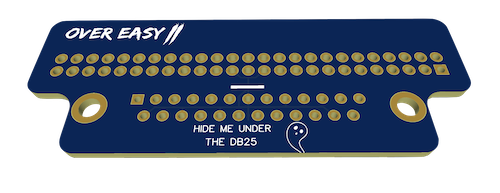

# Three Easy Steps

## Populate the PCB
The only challenge to this step is populating the correct side of the PCB. You're going to feel awfully dense if you populate the wrong side so take a close look at this image.

*See that friendly little ghost? He's there to help you. Make sure your DB25 connector is helping the ghost hide.*

This is the same side you want to install the female SCSI 50 pin header on. If your header has a an indexed key make sure it aligns with the white bar at the center of the board.

## Solder Your Connectors
You know what to do — and if you don't then you should check out YouTube videos which teach how to solder. My recommendation? A temperature controlled soldering iron with quality 60/40 solder and flux. But to each their own.

## Clean Up
This can be a tooth brush with Isolpropyl alcohol or a rinse in the dishwasher (I've done it before!). Personally, I prefer kimwipes with a firm toothbrush and 99% Isopropyl Alcohol.