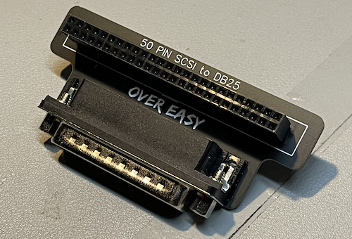
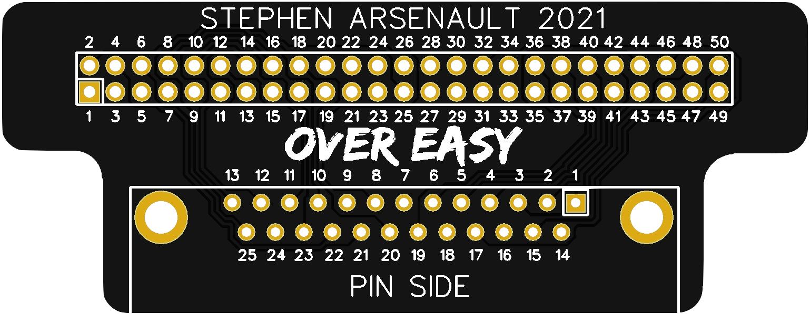

# Over Easy — SCSI 50 Pin Male to DB25 Male

## What is it?
If you're looking for a convenient and open source SCSI adapter then "Over Easy" may be a great option! Designed to convert 50-Pin male SCSI connectors to DB-25, the "Over Easy" is low-profile and suitable for several applications (e.g., mounting the [BlueSCSI](https://github.com/erichelgeson/BlueSCSI) in an enclosure).

## Ordering
Feel free to order the boards from JLCPCB with my [Open Source Hardware link](https://oshwlab.com/stephenarsenault/scsi50-to-db25) or download the gerbers files and modify it for your own use!

