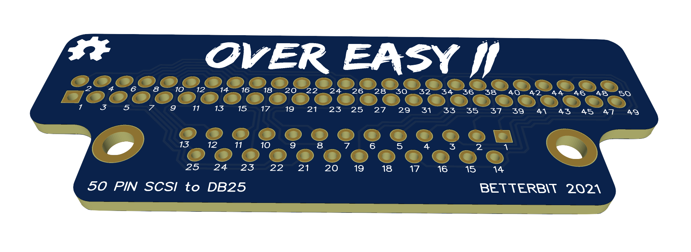
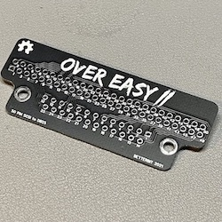
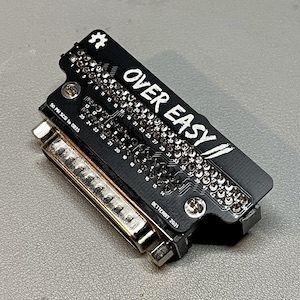
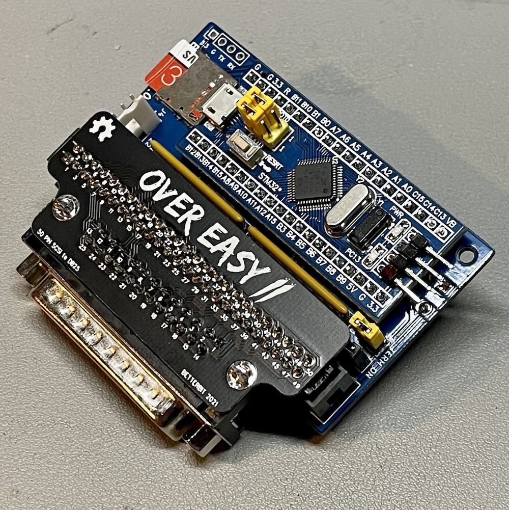
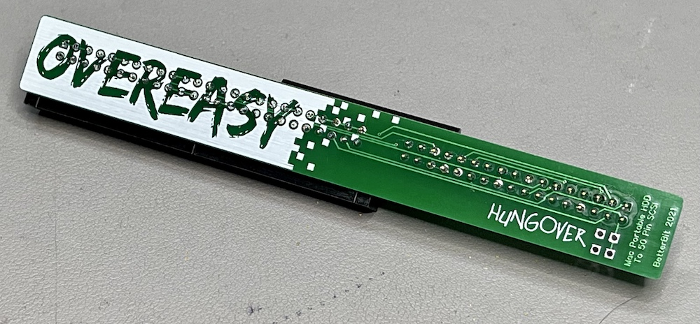
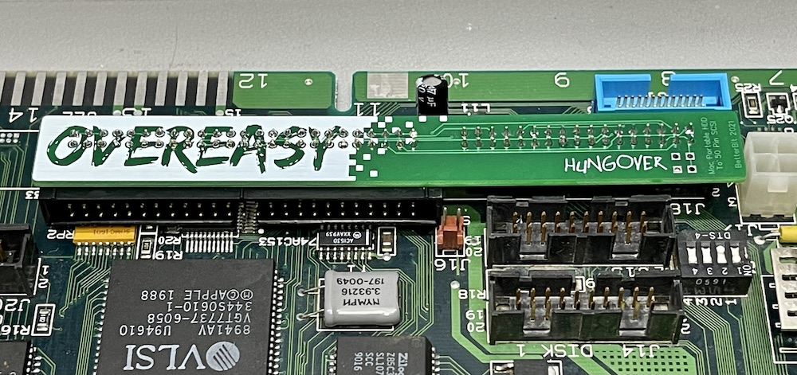

# *What am I looking at?*
Take it easy! If you're looking for a low profile SCSI adapter then you've found an "easy" option. Even better? It's open source and [open hardware](https://oshwlab.com/stephenarsenault/scsi50-to-db25). The Over Easy II converts 50 Pin SCSI male connectors to DB25 male.

*Take a look at how small the overeasy II is on a [BlueSCSI](https://github.com/erichelgeson/BlueSCSI)!*

## Ordering & Supplies
Feel free to order the boards from JLCPCB with my [Open Source Hardware link](https://oshwlab.com/stephenarsenault/scsi50-to-db25) or download the gerber files and modify it for your own use!

You will also need the following parts:
* [DB-25 Right Angle Connector (Male)](https://www.mouser.com/ProductDetail/Amphenol-Commercial-Products/L717SDB25P1ACH4F?qs=wLKqLMNa9uK09vZ5aEaCHw%3D%3D)
* [50-pin Connector 2x25 (Female)](https://www.digikey.com/en/products/detail/sullins-connector-solutions/SFH11-PBPC-D25-ST-BK/1990094) ([Non-Keyed also available](https://www.mouser.com/ProductDetail/3M-Electronic-Solutions-Division/929975-01-25-RK?qs=4V84emjyG36i%2FNBH2jFhRw%3D%3D))

Check out the [assembly instructions](Assembly/README.md) when you're ready to get started.

# Overeasy Hungover

Want 50-pin SCSI support on your Macintosh Portable? Then maybe you need a little hangover. This adapter lets it all hang out on the the logic board so you can plug in your BlueSCSI or other less popular SCSI products directly. Need a little boost? There's 5V and 12V lines chilling out by the namesake silkscreening.

## Ordering & Supplies
Feel free to order the boards from JLPCB with my [Open Source Hardware link](https://oshwlab.com/stephenarsenault/porta-scsi) or download the gerber files and modify it for your own use!

You will also need the following parts:
* Right Angle through-hole 50 POS female connector [Mouser](https://www.mouser.com/ProductDetail/517-30350-5002)
* Through hole 34 POS Male connector [Digikey](https://www.digikey.com/en/products/detail/sullins-connector-solutions/SFH11-PBPC-D17-ST-BK/1990092)
* (Optional) You might want a 50-pin ribbon cable. ([Amazon](https://www.amazon.com/Fielect-Connector-Extension-Conductor-Breadboard/dp/B0817XPB4F/))

## Open Source
The Over Easy SCSI adapter is shared with a [TAPR Open Hardware License](https://tapr.org/the-tapr-open-hardware-license/)

## License

Shield: [![CC BY-NC-SA 4.0][cc-by-nc-sa-shield]][cc-by-nc-sa]

This work is licensed under a
[Creative Commons Attribution-ShareAlike 4.0 International License][cc-by-nc-sa].

